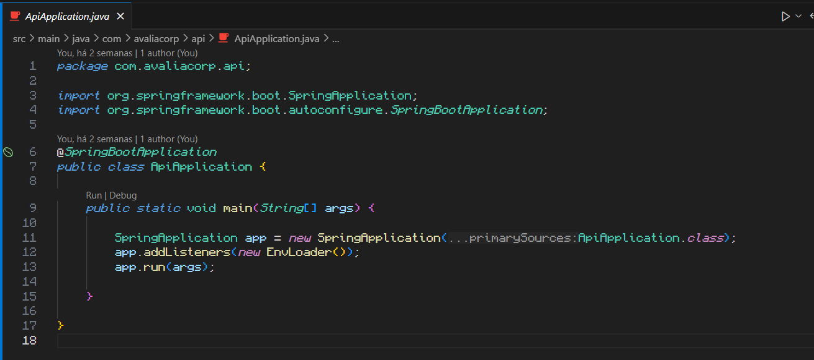

# Rodando o projeto

## Dependência

- ___Dependência: Java JDK 21___

- Extensão do VSCODE: vscjava.vscode-java-pack
Extension Pack for Java

## Rodando localmente

Após clonar o projeto no seu computador, configure as variáveis de ambiente no arquivo .env.example e tire o .example do nome do arquivo

Caso esteja usando o database H2 ou então o HQLDB, o schema.sql irá ser carregado automaticamente, gerando as tabelas do banco de dados se
os dados do .env estiverem corretos. Caso não seja um desses dois, deverá criar as tabelas de outra forma. (Tente criar manualmente).

Após isso vá em em ApiApplication.java (está em: src/main/java/com/avaliacorp/api)
e se as extensões estiverem corretas, deverá estar assim:

Para executar a aplicação, aperte em "run" ou no botão de play no canto direito superior.
Caso queira executar pelo terminal, execute o comando:

- `./mvnw spring-boot:run` (ou `mvn spring-boot:run` caso tenha o Maven instalado)

em um terminal aberto na pastado projeto.

Para acessar a documentação dos endpoints, enquanto a aplicação roda, acesse em um navegador:

- <http://localhost:4200/swagger-docs.html>

Melhorias para a documentação seram feitas!
